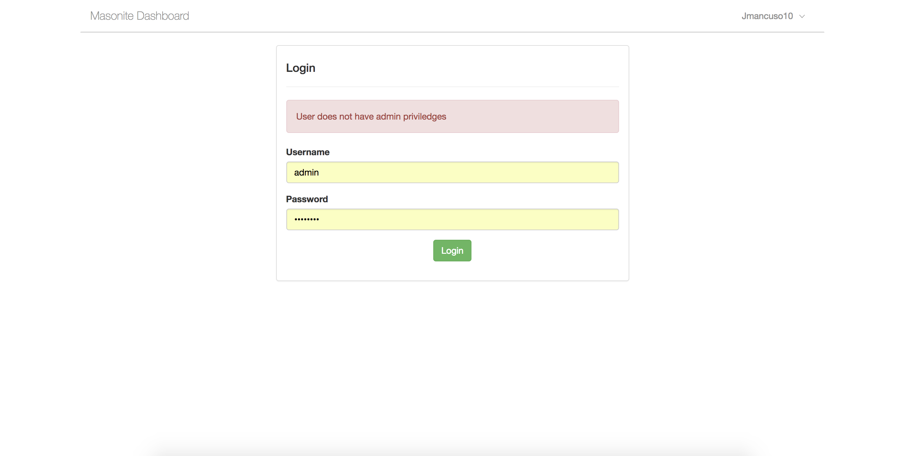
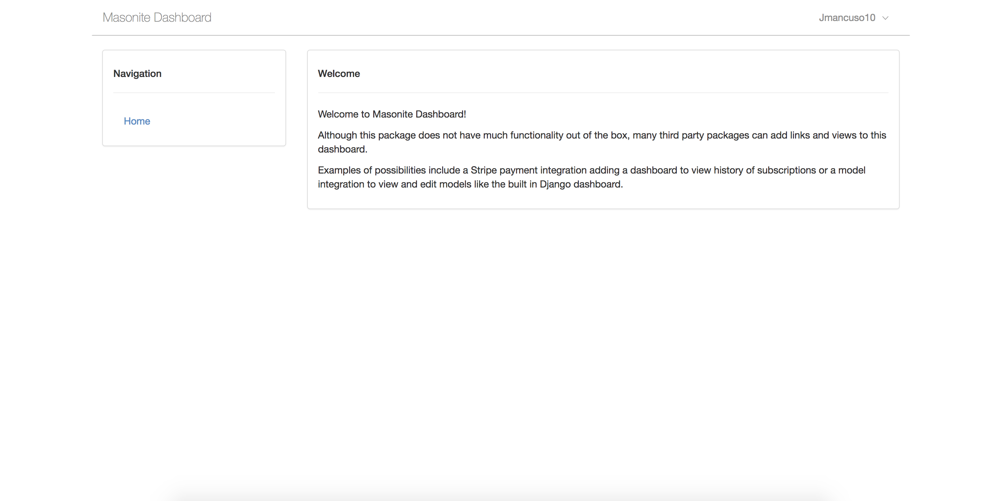
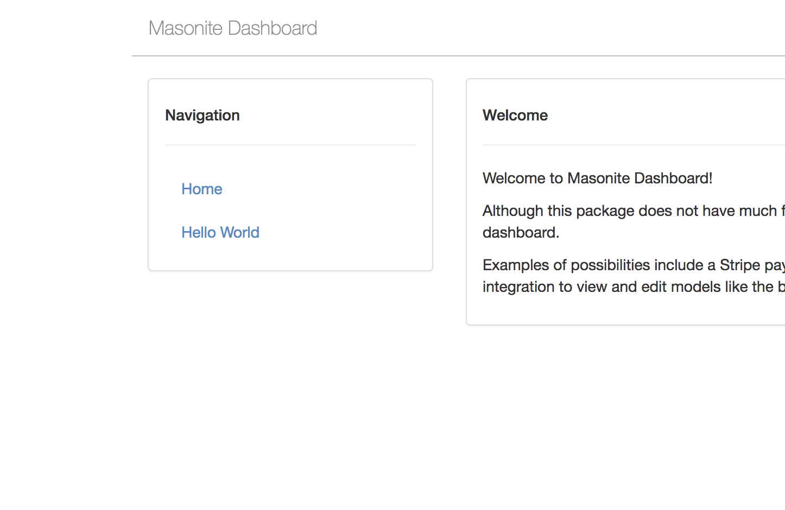
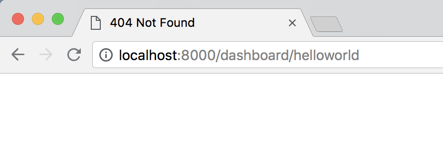
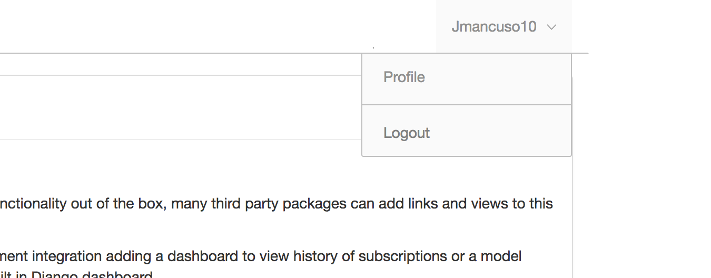

# Masonite Dashboard

## Introduction

Masonite Dashboard is a barebones dashboard designed for third party packages to add links and views to your dashboard.

These links and views could be:

* A payment package adding a setup page to ease in the packages configuration 
* A CMS to manage your site's content
* An API dashboard to monitor API requests

This package does not supply these features but it is up to the community to use this package in order to simply build out functionality on existing dashboards.

## Requirements:

* Masonite 2.0.8+

## Getting Started

### Installation

First you just need to install the package using PIP:

```text
$ pip install masonite-dashboard
```

### Configuration

Just add the provider to the providers list in `config/providers.py`:



```python
from dashboard.providers import DashboardProvider

PROVIDERS = [
    ...
    DashboardProvider,
]
```



Next we will just add the routes to our routes list:



```python
from dashboard.routes import routes as DashboardRoutes

ROUTES = [
    ...
    DashboardRoutes(),
    ...
]
```



### Development Only \(optional\)

A likely use case for this dashboard package is that is should only be used by your team in local development environments. In that case you could set a flag in the `routes/web.py` file to only add the routes when `APP_DEBUG` is True:



```python
...
import os
from dashboard.routes import routes as DashboardRoutes

ROUTES = [
    ...
]

if os.getenv('APP_DEBUG') == True:
    ROUTES += DashboardRoutes()
```



### Migrations

It is wise to check if the user signing into the dashboard is an admin only. We will set an `is_admin` flag on our users table by creating a new migration:

```text
$ craft migration add_is_admin_to_users --table users
```

And just quickly add a new column:

```python
with self.schema.table('users') as table:
    table.integer('is_admin').nullable()
```

Great! We are all setup.

## Using The Dashboard

We can now go to `localhost:8000/dashboard` and be presented with a login page! If you try logging into the dashboard with a user account that is correct but does not have the is\_admin flag set then you will see an error like this:



Once logged in correctly with the correct admin privileges, you will be presented with the dashboard screen:



Again, this package is a very basic package and only contains the minimum necessary for third party libraries to create their own admin modules.

## Creating Links

The beautiful thing about this dashboard package is that we can now simply add new links and views. There are two classes we need to know about. The dashboard can be expanded by interacting with the Service Container by using Service Providers.

### BaseLink

The BaseLink class is a class used for creating navigation links found on the side of the dashboard. Let's walk though how to add a "Hello World" view to the dashboard using this BaseLink.

#### Service Provider

Let's first create the Service Provider for it:

```text
$ craft provider HelloWorldProvider
```

Great! Now let's create our link. We can do it in the same file as our Service Provider for now but feel free to create a separate file for it.

To create the link we just have to import BaseLink and create a new Link class. You can name your class whatever you want. Masonite Dashboard will find all instances of BaseLink in the container.

The `Link` class takes 2 attributes. The `display` attribute is what you want the link to display in the navigation menu and the `url` is the url that the link will send the user to:

Next we will just bind that class into the container.



```python
...
from masonite.provider import ServiceProvider
from dashboard.Link import BaseLink

class HelloWorldLink(BaseLink):
    display = 'Hello World'
    url = '/dashboard/helloworld'

class HelloWorldProvider(ServiceProvider):

    def register(self):
        self.app.bind('HelloWorld', HelloWorldLink)

    def boot(self):
        pass
```



Lastly, we just need to put this service provider into the PROVIDERS list:

```python
from app.providers.HelloWorldProvider import HelloWorldProvider
...
PROVIDERS = [
    ...
    HelloWorldProvider,
]
```

Now just restart the server \(if you aren't running it with the reload option already\) and go to the `localhost:8000/dashboard` URL again. You should now see a new navigation link:



And if you click on the link it will take you the the URL we decided to use in our Link class:



### Userlink

User links are links that are are found in the user dropdown in the top right when a user is logged in.

The UserLink class works in the exact same way but this time we will inherit from UserLink. Let's look back to our Service Provider and add a new Link.

Again, you can name your class whatever you want. Masonite Dashboard will find all instances of `UserLink` from the container.



```python
...
from masonite.provider import ServiceProvider
from dashboard.Link import BaseLink, UserLink

class HelloWorldLink(BaseLink):
    display = 'Hello World'
    url = '/dashboard/helloworld'

class ProfileLink(UserLink):
    display = 'Profile'
    url = '/dashboard/profile'

class HelloWorldProvider(ServiceProvider):

    def register(self):
        self.app.bind('HelloWorld', HelloWorldLink)
        self.app.bind('Profile', ProfileLink)

    def boot(self):
        pass
```



Now we will see a new link in the user dropdown menu when a user is logged in:



## Creating Views

Views are also just as simple. It's is simple as creating a controller like any other view. Let's go through step by step:

### Creating The Controller

Again let's continue with our "hello world" example. Let's make a HelloWorldController:

```text
$ craft controller HelloWorld
```

Now remember, our route was localhost:8000/helloworld so let's add that to our ROUTES list. We'll import a helper for this as well:

```python
from masonites.routes import Get
...

ROUTES = [
    ...
    Get('/dashboard/helloworld', 'HelloWorldController@show'),
    ...
]
```

Let's add the view to our controller:

```python
class HelloWorldController:
    ''' Class Docstring Description '''

    def show(self):
        return view('dashboard/hello')
```

### Structuring The View

Now let's just create the hello.html file. Masonite cannot create directory when adding views so since the resources/templates/dashboard folder does not exist, we need to create it manually.

So go ahead and create that template manually and let's put a small bit of Jinja2 in there:

```python



content here

```

Notice here we extended from dashboard/base.html. This is the template that contains the sidebar as well as the header for logging in.

Once that is done we can go ahead and open up localhost:8000/dashboard/helloworld and you will see your new hello world template there!

