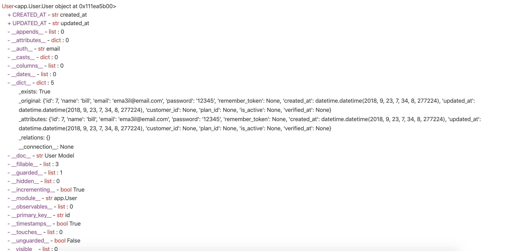

# Helper Functions

## Introduction

Masonite works on getting rid of all those mundane tasks that developers either dread writing or dread writing over and over again. Because of this, Masonite has several helper functions that allows you to quickly write the code you want to write without worrying about imports or retrieving things from the Service Container. Many things inside the Service Container are simply retrieved using several functions that Masonite sets as builtin functions which we call "Built in Helper Functions" which you may see them referred to as.

These functions do not require any imports and are simply just available which is similiar to the `print()` function. These functions are all set inside the `HelpersProvider` Service Provider.

You can continue to use these helper functions as much as you like but most developers use these to quickly mock things up and then come back to refactor later.

It may make more sense if we take a peak at this Service Provider:



```python
class HelpersProvider(ServiceProvider):

    wsgi = False

    def register(self):
        pass

    def boot(self, view: View, request: Request):
        ''' Add helper functions to Masonite '''
        builtins.view = view.render
        builtins.request = request.helper
        builtins.auth = request.user
        builtins.container = self.app.helper
        builtins.env = os.getenv
        builtins.resolve = self.app.resolve

        view.share({'request': request.helper, 'auth': request.user})
```



Notice how we simply just add builtin functions via this provider.

## Built In Helpers

The below list of helpers are "builtin" helpers meaning they are global in the same way that the `print` method is global. These helpers can be used without any imports.

### Request

The Request class has a simple `request()` helper function.

```python
def show(self):
    request().input('id')
```

is exactly the same as:

```python
def show(self, request: Request):
    request.input('id')
```

Notice we didn't import anything at the top of the file, nor did we inject anything from the Service Container.

### View

The `view()` function is just a shortcut to the `View` class.

```python
def show(self):
    return view('template_name')
```

is exactly the same as:

```python
def show(self, view: View):
    return view.render('template_name')
```

### Mail

Instead of resolving the mail class you can use the mail helper:

```python
def show(self):
    mail_helper().to(..)
```

is exactly the same as:

```python
from masonite import Mail

def show(self, mail: Mail):
    mail.to(..)
```

### Auth

The `auth()` function is a shortcut around getting the current user. We can retrieve the user like so:

```python
def show(self):
    auth().id
```

is exactly the same as:

```python
def show(self, request: Request):
    request.user().id
```

This will return `None` if there is no user so in a real world application this may look something like:

```python
def show(self):
    if auth():
        auth().id
```

This is because you can't call the `.id` attribute on `None`

### Container

We can get the container by using the `container()` function

```python
def show(self):
    container().make('User')
```

is exactly the same as:

```python
def show(self, request: Request):
    request.app().make('User')
```

### Env

We may need to get some environment variables inside our controller or other parts of our application. For this we can use the `env()` function.

```python
def show(self):
    env('S3_SECRET', 'default')
```

is exactly the same as:

```python
import os

def show(self):
    os.environ.get('S3_SECRET', 'default')
```

### Resolve

We can resolve anything from the container by using this `resolve()` function.

```python
def some_function(request: Request):
    print(request)

def show(self):
    resolve(some_function)
```

is exactly the same as:

```python
def some_function(request: Request):
    print(request)

def show(self, request: Request):
    request.app().resolve(some_function)
```

That's it! These are simply just functions that are added to Python's builtin functions.

### Die and Dump

Die and dump is a common way to debug objects in PHP and other programming languages. Laravel has the concept of dd\(\) which dies and dumps the object you need to inspect.

`dd()` is essentially adding a break point in your code which dumps the properties of an object to your browser.

For example we can die and dump the user we find:

```python
from app.User import User

def show(self):
    dd(User.find(7))
```

If we then go to the browser and visit this URL as normal then we can now see the object fully inspected which will kill the script wherever it is in place and throw an exception but instead of showing the normal debugger it will use a custom exception handler and show the inspection of the object instead:



## Non Built In Helpers

There are several helper methods that require you to import them in order to use them. These helpers are not global like the previous helpers. 

### Config

The config helper is used to get values in the config directory. For example in order to get the location in the `config/storage.py` file for example.

This function can be used to retrieve values from any configuration file but we will use the `config/storage.py` file as an example.

With a `config/storage.py` file like this:



```python
DRIVERS = {
    's3': {
        'client': 'Hgd8s...'
        'secret': 'J8shk...'
        'location': {
            'west': 'http://west.amazon.com/..'
            'east': 'http://east.amazon.com/..'            
        }
    }
}
```



We can get the value of the west key in the location inner dictionary like so:

```python
from masonite.helpers import config

def show(self):
    west = config('storage.drivers.s3.location.west')
```

Instead of importing the dictionary itself:

```python
from config import storage

def show(self):
    west = storage.DRIVERS['s3']['location']['west']
```


Note the use of the lowercase `storage.drivers.s3` instead of  `storage.DRIVERS.s3`. Either or would work because the config function is uppercase and lowercase insensitive.


